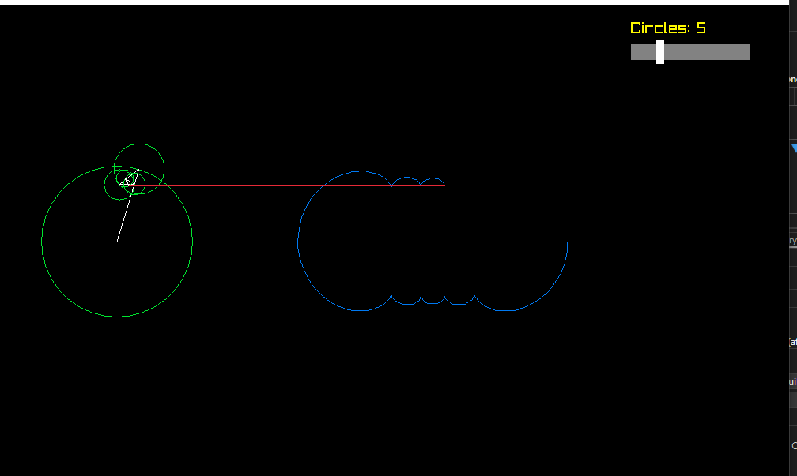

# Fourier Series Visualization in C++

This project visualizes the Fourier series in action using **Raylib**. The simulation represents the Fourier series as a set of rotating circles, dynamically building a waveform. A slider allows you to adjust the number of circles in real time while the graph continues to animate.

---

## Features

1. **Dynamic Circle Count**:
   - Adjust the number of circles with a slider, from 1 to 20.
   - The waveform and animation update in real time.

2. **Smooth Visualization**:
   - Rotating circles represent the Fourier series terms.
   - A graph is dynamically drawn from the last circle's position.

3. **Colorful Design**:
   - **Green** circles, **white** connecting lines, **blue** waveform, and a **red** guiding line.
   - Interactive slider with **gray**, **white**, and **yellow** accents.

---

## How It Works

1. **Fourier Series Representation**:
   - Uses odd harmonics to approximate a periodic waveform.
   - Each circle represents a term in the series, with its size and rotation based on the harmonic.

2. **Real-Time Updates**:
   - The slider dynamically changes the number of terms (circles) contributing to the waveform.
   - The graph continues animating smoothly while adjustments are made.

3. **Animation**:
   - The circles rotate, and their combined effect is used to trace a waveform on the screen.

---

## Controls

- **Slider**: Drag the slider on the screen to increase or decrease the number of circles.
- **Real-Time Animation**: The waveform updates as you adjust the slider.

## Customization

1. **Change Maximum Circles**:
   - Modify the `maxCircles` variable in the source code to increase or decrease the slider's range.

2. **Adjust Colors**:
   - Update the `DrawCircleLines`, `DrawLine`, and `DrawText` function calls to use different colors.

3. **Enhance Graph Length**:
   - Change the `wave.size()` limit to store more points in the waveform.

---

## Screenshot

## License

This project is open-source and released under the MIT License. Feel free to use, modify, and distribute it.

---

